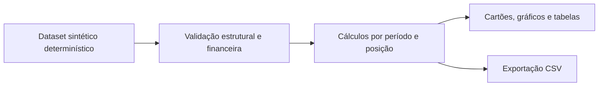

# Arquitetura e caminho de integração

## Separação de responsabilidades

`src/domain/types.ts` descreve unidades, pagadores, contas, eventos, custos e metas. `src/domain/finance.ts` é a única origem dos valores financeiros. `App.tsx` aplica filtros e apresenta o contexto. As telas e o exportador consomem o mesmo resultado.

A aplicação opera no navegador e não faz chamadas de dados a serviços externos. A base demonstrativa é distribuída junto com a aplicação. Não existe login, multiusuário, escrita financeira, importador ou persistência de registros.

## Fontes e grãos

| Entidade | Grão                                    | Observações                                                                        |
| -------- | --------------------------------------- | ---------------------------------------------------------------------------------- |
| Conta    | Uma cobrança original                   | Identificador único, unidade, pagador, serviço, datas e valor inteiro em centavos. |
| Evento   | Um movimento financeiro de uma conta    | Pagamento, glosa, reversão ou baixa. Valores positivos; o tipo determina o efeito. |
| Custo    | Lançamento por unidade, mês e categoria | Não atribuído a pagador.                                                           |
| Meta     | Unidade e mês                           | Uma versão nesta demo; versionamento e vigência exigem expansão do contrato.       |

`serviceDate`, `billedDate`, `dueDate` e `FinancialEvent.date` são campos distintos. O resultado demonstrativo é baseado na emissão. Não se deve renomeá-lo para receita contábil reconhecida sem definir a política do prestador.

## Validação

O motor verifica integridade e consistência aritmética antes da apresentação. Testes cobrem corte temporal, pagamentos parciais, eventos posteriores à posição, glosas, valores nulos sem base comparável, metas alinhadas e reconciliação. O CSV é testado para preservação monetária e proteção contra execução de fórmulas em planilhas.

Na integração real, uma validação de entrada em tempo de execução deverá verificar também a forma de JSON/CSV externo, antes de tratá-lo como `Dataset`. A função do modelo é voltada ao contrato tipado; TypeScript sozinho não valida dados recebidos pela rede.

## Integração real, em sequência

1. Definir clínica, hospital, laboratório ou outro prestador, unidades e pagadores.
2. Selecionar a fonte autorizada: ERP/faturamento, retornos dos pagadores, banco, custos e orçamento.
3. Mapear IDs estáveis de conta, item, lote, parcela, pagamento e recurso. A versão atual tem eventos por conta; contratos complexos podem exigir itens e alocação de pagamentos entre várias contas.
4. Definir política de cancelamento, estorno, impostos, retenções, provisões e reconhecimento da receita. Esses eventos não devem ser codificados como glosas por conveniência.
5. Implementar adaptador com extração reproduzível, validação, deduplicação e reconciliação. Não sobrescrever dados originais.
6. Acrescentar backend autenticado, autorização por unidade/função e acesso ao detalhe. Dados reais ficam fora do bundle e do Git.
7. Conciliar um período fechado, por conta e total, com os relatórios oficiais do prestador antes de uso operacional.

## Escopo dos alertas

Os alertas derivam dos números disponíveis: saldo vencido, saldo em recurso, resultado negativo e metas. Não atribuem causas clínicas ou comerciais e não utilizam IA. Os limiares demonstrativos não são parâmetros setoriais ou limites oficiais.

## Referências de domínio

- [ANS: faturamento e pagamento dos serviços prestados](https://www.gov.br/ans/pt-br/assuntos/prestadores/fator-de-qualidade-1/obrigatoriedade-do-contrato-escrito-1/faturamento-e-pagamento-dos-servicos-prestados): condições e prazos próprios da relação entre prestador e operadora.
- [ANS: indicadores de glosa](https://www.gov.br/ans/pt-br/acesso-a-informacao/perfil-do-setor/dados-e-indicadores-do-setor/painel-de-indicadores-de-glosa): referência externa; as métricas deste projeto não declaram equivalência aos indicadores oficiais.

Os dados públicos dessas páginas não foram usados como se fossem as contas do prestador. Na integração com operadoras, a versão do TISS e o mapeamento de mensagens deverão ser conferidos na documentação vigente naquele momento.
